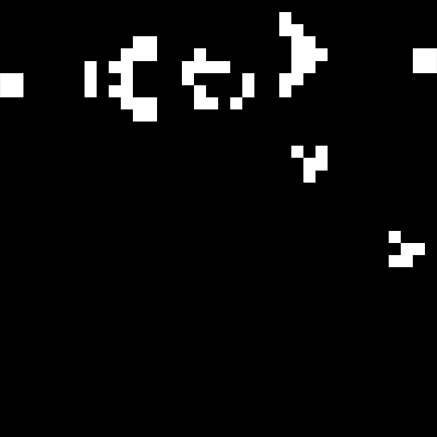
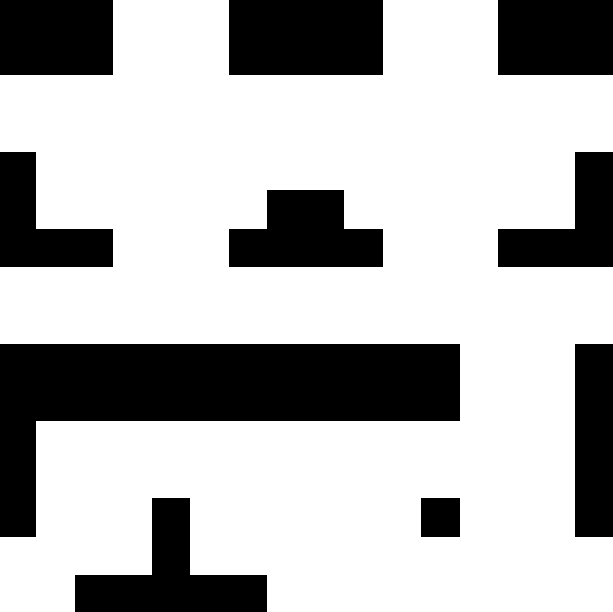

# 康威生命遊戲（Conway's Game of Life）— 互動版

這個專案基於經典的 **康威生命遊戲**，並加入了更多互動功能，包括載入預設圖案、互動式細胞與障礙物的擺放、動態區域影響以及基於圖片初始化的網格生成。

## 功能特性

1. **經典生命遊戲**：
   - 完整實現細胞的生存、繁殖、死亡規則。

2. **動態區域**：
   - **優勢區域 (藍色)**：有利於細胞的生存與繁殖。
   - **劣勢區域 (紅色)**：限制細胞的生存與繁殖。
   - 這些區域會在模擬過程中順時針移動。

3. **載入預設圖案**：
   - 支援從 `patterns` 資料夾中載入預設圖案。
   - 使用鍵盤上的數字鍵 (0–9) 在滑鼠游標處插入圖案。

4. **互動操作**：
   - 暫停與繼續 (`P`)。
   - 左鍵點擊新增細胞。
   - 右鍵清除區域內的細胞與障礙物。
   - 中鍵新增障礙物。
   - 數字鍵 (0–9) 插入圖案。

5. **基於圖片的網格初始化**：
   - 使用 Sobel 邊緣檢測與高斯平滑，將圖片轉換為二值化網格作為遊戲的起始狀態。

---

## 環境需求

請確保已安裝以下 Python 套件：

- `pygame`
- `numpy`
- `scipy`
- `Pillow` (PIL)
- `matplotlib` (僅用於圖片初始化模擬)

安裝所有套件：

```bash
pip install -r requirements.txt
```

---

## 如何運行

### 互動式模擬

1. 確保 `test.py` 和 `patterns` 資料夾在同一目錄下。
2. 運行模擬：

   ```bash
   python test.py
   ```

3. **控制方式**：
   - **P**：暫停/繼續。
   - **滑鼠左鍵**：新增活細胞。
   - **滑鼠右鍵**：清除以滑鼠為中心的 10x10 區域內細胞與障礙物。
   - **滑鼠中鍵**：新增障礙物。
   - **數字鍵 0–9**：在滑鼠位置插入預設圖案。

---

## 預設圖案示例（數字鍵 0–9）

使用鍵盤數字鍵插入以下預設圖案：

| 按鍵 | 圖案名稱       | 圖片示例               |
|------|----------------|------------------------|
| 0    | 脈衝星         |  |
| 1    | 高斯帕機槍     |  |
| 2    | 太空船         |  |
| 3    | 慨影           |  |
| 4    | 紅綠燈         |  |
| 5    | 人             |  |
| 6    | 工             |  |
| 7    | 智             |  |
| 8    | 慧             |  |
| 9    | 四             |  |

> **注意**：請將上述圖片存放在 `patterns` 資料夾內，並以對應檔名命名。

---

### 基於圖片的模擬

1. 將要使用的圖片放置於專案目錄中。
2. 運行 `image_app.py`，並指定圖片檔案：

   ```bash
   python image_app.py --image your_image.jpg --grid-size 500
   ```

---

## 資料夾結構

``` txt
.
├── test.py               # 主互動模擬腳本
├── image_app.py          # 基於圖片的模擬腳本
├── patterns/             # 預設圖案資料夾
│   ├── 0.png
│   ├── 1.png
│   └── ...
├── examples/             # 圖片初始化模擬範例
├── README.md             # 專案說明文件
```

---

## 自訂圖案

1. 在 `patterns/` 資料夾內新增圖案圖片（格式支援 PNG、JPG）。
2. 在 `test.py` 中設定每個圖案的網格大小：

   ```python
   grid_sizes = [17, 36, 5, ...]  # 根據每個圖案調整
   ```

3. 運行模擬並使用數字鍵插入自訂圖案。
